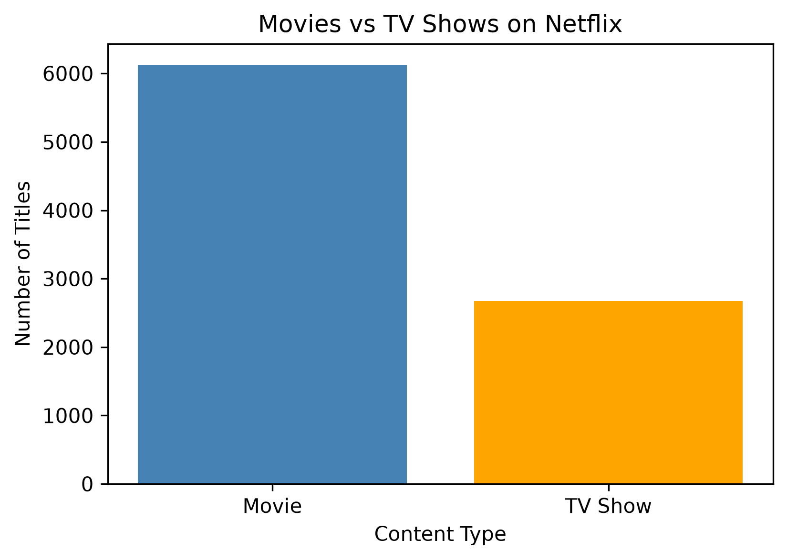
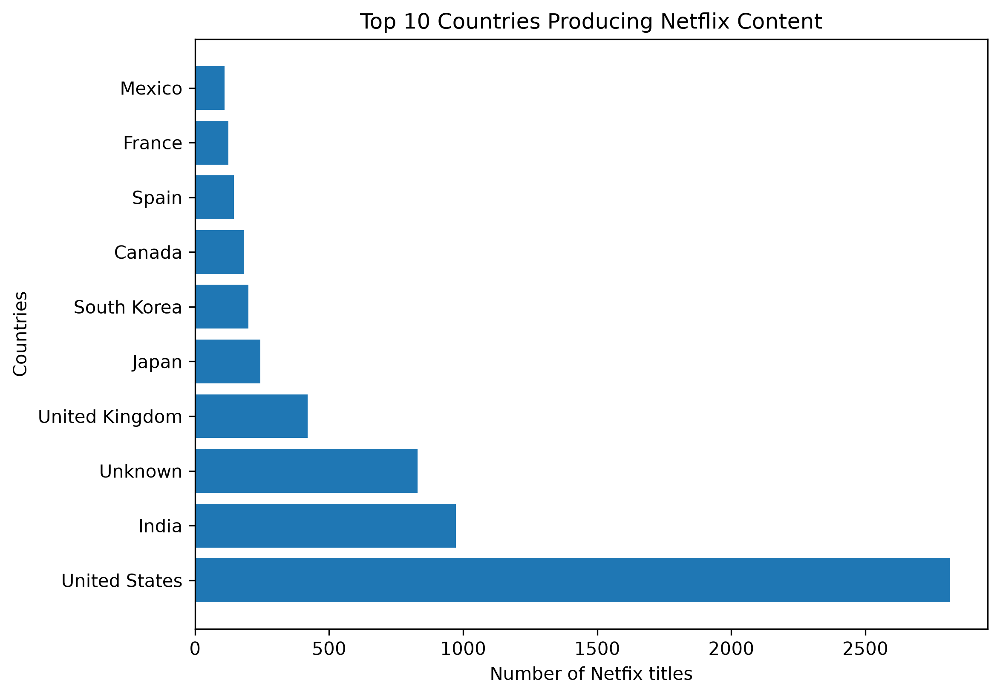
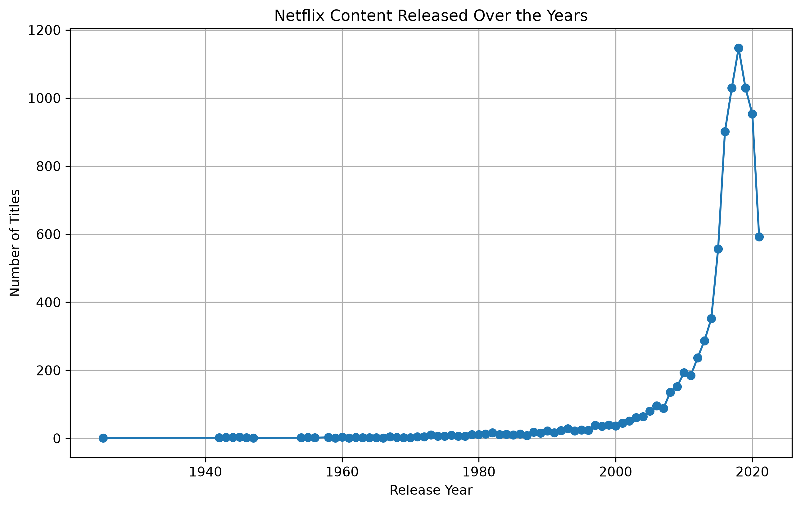
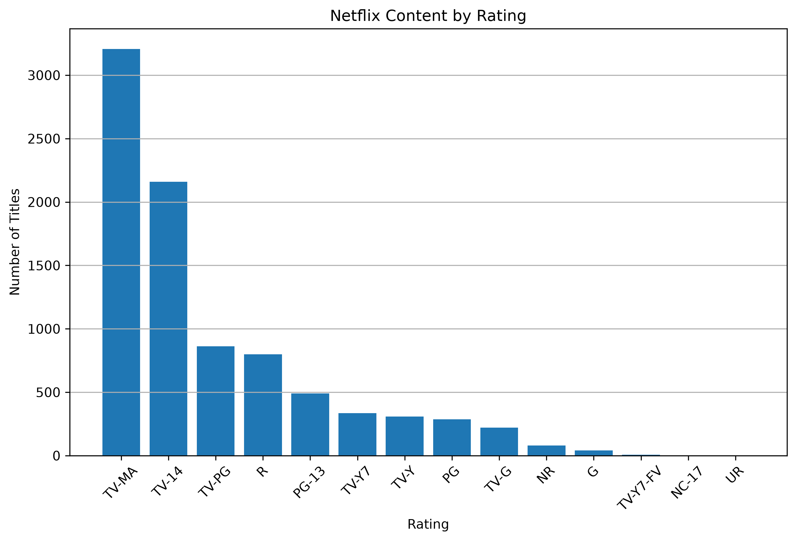
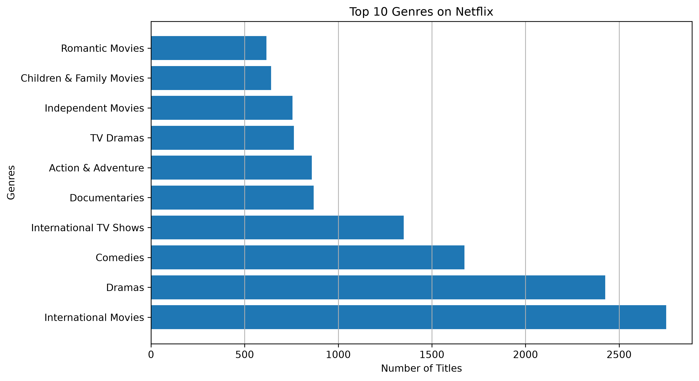

# Netflix Data Analysis

## Project Overview

This project performs Exploratory Data Analysis (EDA) on the Netflix Titles dataset using Python.

---

## Dataset

- Netflix Titles Dataset
- Source: Kaggle
- Rows: 8807
- Columns: 12

---

## Technologies Used

- Python
- Pandas
- NumPy
- Matplotlib
- Jupyter Notebook

---

## Installation

```bash
git clone <repository-url>
cd Netflix-Data-Analysis

pip install -r requirements.txt
```

---

## Run the Project

```bash
jupyter notebook
```

Open `Netflix_EDA.ipynb` and run all the cells.

---

## Visualizations

### 1. Movies vs TV Shows



---

### 2. Top 10 Countries Producing Netflix Content



---

### 3. Netflix Content Released Over the Years



---

### 4. Netflix Content by Rating 



---

### 5. Top 10 Genres On Netflix



---

## Key Insights

### Insight 1
Movies dominate Netflix's catalog, with over 6,100 titles, while TV Shows account for around 2,700 titles.

### Insight 2

The United States contributes the highest number of Netflix titles, followed by India, highlighting Netflix's strong presence in these markets.

### Insight 3

Netflix content production remained relatively low before 2010. After 2010, the number of titles released increased rapidly and reached its highest level around 2020, indicating Netflix's rapid global growth and increased investment in content production.

### Insight 4

Netflix primarily targets teenagers and adults, as TV-MA and TV-14 are the most common content ratings in the catalog.

### Insight 5

International Movies is the most common genre on Netflix, followed by Dramas and Comedies. This suggests that Netflix emphasizes diverse global content to appeal to audiences across different countries and cultures.
---

## Future Improvements

- Genre Analysis
- Rating Distribution
- Duration Analysis

---

## Author

**Rithwik Nalla**

